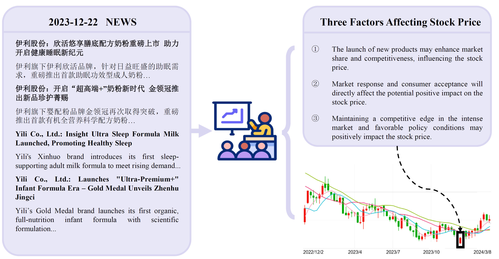
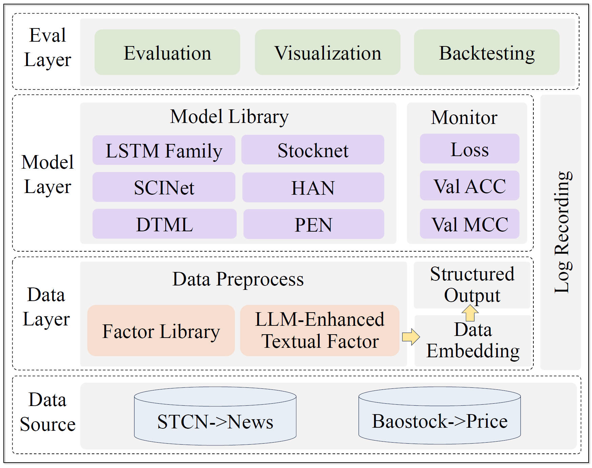

# [CSMD: Curated Multimodal Dataset for Chinese Stock Analysis](https://arxiv.org/)

## 📝 CSMD version 1.0:  — Chinese Stock Multimodal Dataset
CSMD, a novel multimodal dataset for the Chinese stock market that encompasses stock prices and financial news texts, which is publicly available for research use. It includes mainly five advantages:

- ✅ CSMD integrates stock prices and financial news texts, with data rigorously curated and processed to ensure high quality and relevance.

- ✅ By leveraging large language models for factor extraction from news texts, CSMD enhances interpretability and facilitates understanding of market dynamics.

- ✅ News is sourced from authoritative outlets like Securities Times, ensuring authenticity and credibility of the information.

- ✅ The data undergoes meticulous preprocessing and denoising, effectively improving data quality and training efficiency.

In summary, CSMD is dedicated to providing high-quality multimodal data and flexible tools to advance research and applications in financial prediction.

Currently, the CSMD V1.0 dataset including CSMD50 and CSMD300 is available to the public, with plans to continuously update and refine datasets in the future.

## 💡 LightQuant version 1.0:  — Lightweight Quantitative Framework for Stock Market Prediction
LightQuant is a lightweight quantitative framework for stock market prediction. It is designed to provide a flexible, modular framework supports multimodal data analysis, model training, and strategy backtesting, meeting diverse research requirements. With its modular design and flexible data processing capabilities, LightQuant aims to simplify the process of building and testing stock market prediction models.

🤗 We hope to provide a comprehensive, convenient, one-stop evaluation solution for the entire industry.

## 🚀 Changelog
- **[2024.06.16]** CSMD has now open-sourced part of the datasets and the complete data processing flow and code! We hope to open source the complete dataset and more detailed code after the paper is accepted. [Download dataset here](./dataset) 🚀🚀🚀

## ✨ Table of Contents
- [Data](#data)
- [Quick Start](#quick-start)
- [Leaderboard](#leaderboard)
- [TODO](#todo)
- [Disclaimer](#disclaimer)
- [Licenses](#licenses)

## Data
Our dataset collected data from trusted, authoritative sources, primarily including official Chinese financial media such as Securities Times, ensuring high authenticity and relevance. The dataset features rich multimodal information—combining stock prices and financial news texts—to support comprehensive research and modeling. We implement rigorous preprocessing steps, including data cleaning, denoising, and feature extraction, to enhance data quality and usability. Additionally, we leverage large language models (LLMs) like GPT-4 to extract impactful financial factors from news texts, significantly improving interpretability and aiding downstream tasks. This integrated approach ensures our dataset not only captures real-market dynamics but also supports robust, explainable financial analysis.

Here we show the process of how LLM extracts financial factors from news texts:


## Quick Start

To get started with CSMD, follow these steps:
1. **Installation**: Install the necessary dependencies by running the following command:
```python
pip install -r requirements.txt
```
2. **Download**: Download our dataset
You can download the dataset from [here](./dataset).

Of cource, you can build your own dataset with our method. We open source our data collecting and processing flow and code, you can refer to ./data_construction to build your own dataset.
```python
./dataset_construction/news_scraper.py  # this file is used to collect news data
./llm_factor/extract_factors.py  # this file is used to extract financial factors from news texts
```
3. **Usage**: Use the dataset in your own projects or use our framework to evaluate.
Let me show you the structure of our framework:
```python
./dataset  # this folder contains all the datasets
./evaluate # this folder contains the evaluation method of LLM's readability.
./model    # this folder contains the main models of our framework.
./price_experiment # this folder contains the code with single-modal(price) experiment.
./price_news_experiment # this folder contains the code with multi-modal(price and news) experiment.
./result # this folder contains the results of the experiment.
./utils # this folder contains the main utils.
./backtest # this folder contains the code with backtesting.
./llm_factor # this folder contains the code with extracting financial factors from news texts.
```
Then we can start to use our framework:
```python
1. python ./utils/word2vec.py  --dataset CSMD50 --csv_news_path --embedding_path --local_model_path --trading_date_list #  generate word2vec embedding
2. python ./utils/util.py  --dataset CSMD50  # process and split the dataset
3. bash run.sh or python run.py # you can configurate the parameters in run.sh or run.py
4. bash run_backtest.sh # you can configurate the parameters in run_backtest.sh to backtest the model
```

## Leaderboard
Below, we list the performance of the models we evaluated in the initial version. We have conducted a comprehensive assessment of various models on CSMD50 and CSMD300.

### Performance comparison on the benchmark dataset.
| Model    | CSMD 300 ACC | CSMD 300 MCC | CSMD 50 ACC | CSMD 50 MCC | CMIN-CN ACC | CMIN-CN MCC |
|----------|--------------|--------------|-------------|-------------|-------------|-------------|
| LSTM     | 53.37        | 0.0532       | 53.61       | 0.0729      | 53.28       | 0.0548      |
| BiLSTM   | 53.70        | 0.0601       | 53.98       | 0.0780      | 53.46       | 0.0571      |
| ALSTM    | 53.62        | 0.0633       | 54.21       | 0.0886      | 53.35       | 0.0236      |
| Adv-LSTM | 54.08        | 0.0662       | 54.01       | 0.0840      | 53.49       | 0.0253      |
| SCINet   | 53.36        | 0.0595       | 53.02       | 0.0534      | 53.11       | 0.0541      |
| DTML     | 54.13        | 0.1478       | 54.12       | 0.0972      | 53.42       | 0.0334      |
| Stocknet | 55.47        | 0.0916       | 55.11       | 0.0746      | 54.53       | 0.0450      |
| HAN      | 53.59        | 0.0259       |             |             |             |             |
| PEN      | 53.27        | 0.0893       | 53.12       | 0.0582      | 53.68       | 0.0871      |

### The backtesting results on the CSMD 50 dataset.
| Models    | ARR    | SR     | MDD    | CR     | ACC    |
|-----------|--------|--------|--------|--------|--------|
| LSTM      | 0.0884 | -0.9203 | 0.0256 | 2.7739 | 0.5351 |
| BiLSTM    | 0.0864 | -0.7556 | 0.0250 | 2.8349 | 0.5386 |
| ALSTM     | 0.1203 | 0.8192  | 0.0308 | 2.9170 | 0.5477 |
| Adv-LSTM  | 0.0734 | -1.2998 | 0.0227 | 2.7466 | 0.5481 |
| SCINet    | 0.0269 | 0.0627  | 0.0219 | 0.8151 | 0.5354 |
| DTML      | 0.0228 | -1.4838 | 0.0597 | 0.5469 | 0.5344 |
| StockNet  | 0.1301 | 0.7108  | 0.0318 | 3.0182 | 0.5581 |
| HAN       | 0.0764 | -0.8147 | 0.0149 | 2.9763 | 0.5228 |
| PEN       | 0.1004 | 0.0271  | 0.0351 | 1.6830 | 0.5337 |


## TODO
- [x] Release the complete dataset;
- [x] Add more prediction models;
- [x] Optimize the backtesting strategy;
- [x] Refine the details of our framework;

## Disclaimer
⚠️ We assume no legal liability for the use of the open-source model and datasets. Users are responsible for independently assessing and assuming any potential risks associated with using the framework or data, and should always exercise caution.
We recommend that users independently verify and analyze the model's outputs, and make informed decisions based on their specific needs and real-world scenarios.
By providing open-source data and models, we aim to offer valuable tools for academic research and industry applications, promoting advancements in artificial intelligence technology within data analysis, financial innovation, and other related fields.
⚠️ The use of our open-source model and dataset for commercial purposes is prohibited. The copyright of the original news content belongs to Securities Times. We only release processed and derived data, such as timestamps, sentiment scores, and embeddings, without including any raw or verbatim news text.
We encourage users to fully leverage their creativity, deeply explore the potential of our work, expand its application scenarios, and collectively drive progress and practical implementation of AI technologies across various domains.

## Licenses

⚠️ This project adheres to [MIT License](https://lbesson.mit-license.org/).


⚠️ The CSMD dataset follows [Creative Commons Attribution-NonCommercial-ShareAlike 4.0 International License](http://creativecommons.org/licenses/by-nc-sa/4.0/).

